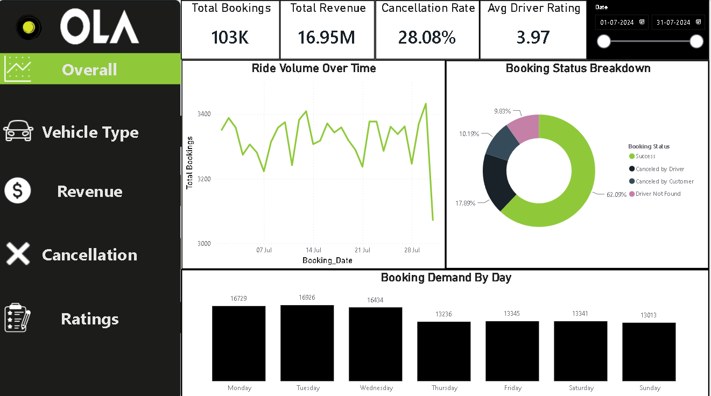
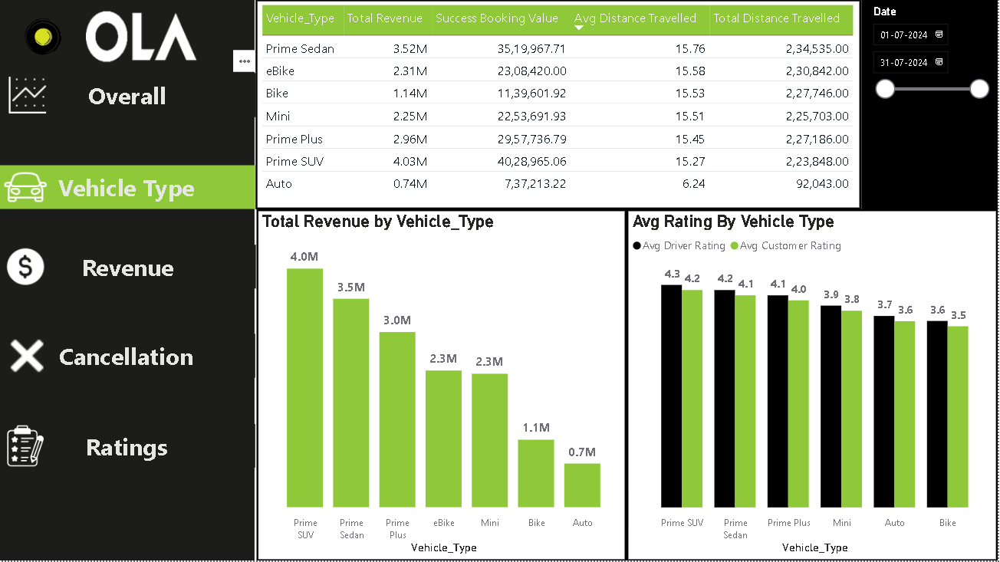
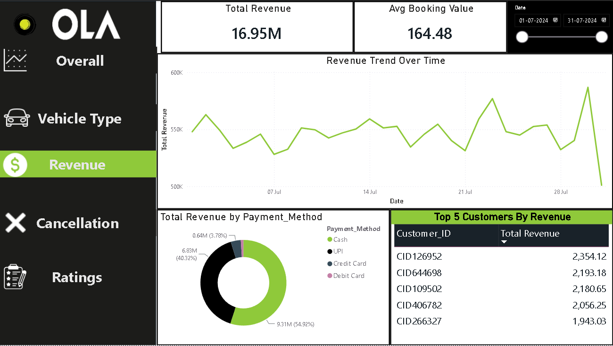
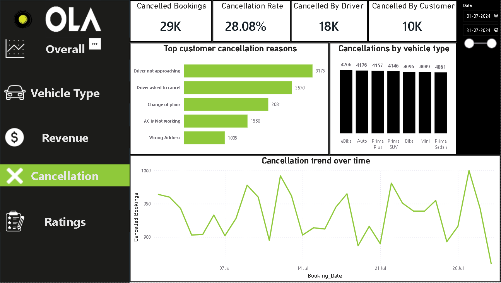
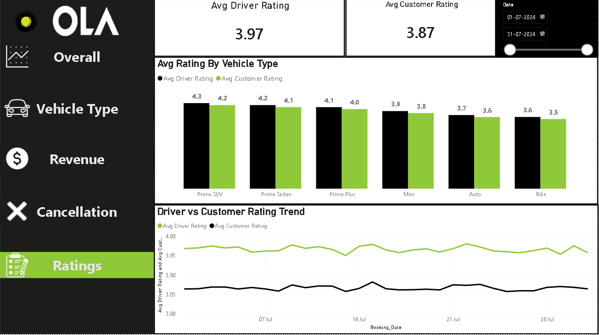
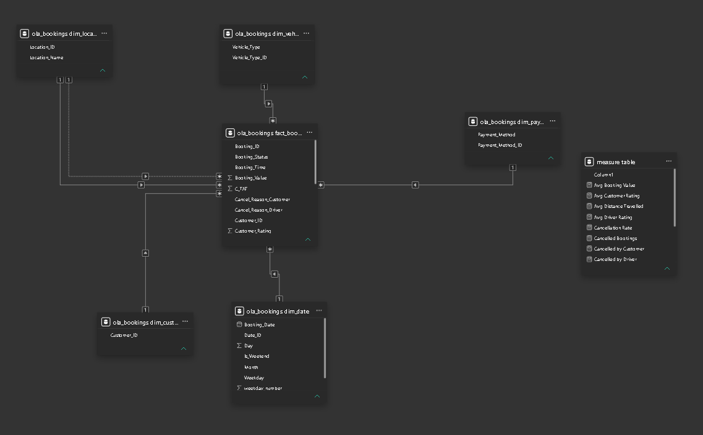

# OLA Ride Bookings — SQL + Power BI Dashboard

An end-to-end data analytics project: cleaning and modeling 100,000+ raw ride-booking
records in MySQL, then building a 5-page interactive Power BI dashboard on top of it.

## Overview

- **Dataset**: ~103,000 ride bookings for the month of July, including booking status,
  vehicle type, pickup/drop location, payment method, ride distance, booking value,
  cancellation reasons, and driver/customer ratings.
- **Goal**: turn a messy raw export into a clean, query-able data warehouse, then surface
  business-relevant insights (cancellations, revenue, ratings, demand patterns) through
  an interactive dashboard.

## Tools used

- **MySQL Workbench** — staging, data cleaning, star-schema modeling, analysis queries
- **Power BI Desktop** — data modeling, DAX measures, 5-page interactive dashboard
- **DAX** — custom measures for KPIs (cancellation rate, average ratings, revenue, etc.)

## Data cleaning

- Loaded the raw file into a staging table with all columns as text, to avoid import
  errors from inconsistent formatting.
- Converted empty/placeholder values into true `NULL`s.
- Standardized category text (vehicle type, payment method, booking status).
- Verified no duplicate `Booking_ID`s.

## Data model — star schema

```
                dim_date
                    |
dim_customer -- fact_bookings -- dim_vehicle_type
                    |
           dim_location (pickup + drop)
                    |
             dim_payment_method
```

- **fact_bookings**: one row per booking, with foreign keys to each dimension, plus
  measures like `Booking_Value`, `Ride_Distance`, `Driver_Ratings`, `Customer_Rating`.
- **dim_location** is joined twice (pickup and drop) — one relationship active, one
  inactive, switched via `USERELATIONSHIP()` in DAX where needed.
- **dim_date** includes calendar attributes (day, month, weekday) for time-based analysis.

SQL scripts for all of this are in the [`/sql`](./sql) folder, in order:
1. `01_data_cleaning_ola_dataset.sql` — staging table creation, null/whitespace cleaning, dedup checks
2. `02_data_modelling_in_sql_ola.sql` — star schema DDL and loading staging data into dimension + fact tables
3. `03_sql_questions_ola_dataset.sql` — the 10 core SQL analysis questions, saved as reusable views
4. `04_realism_adjustments.sql` — optional adjustments to ratings/pricing (see note below)

## Dashboard

5 pages, each with a custom-built navigation sidebar:

| Page | Contents |
|---|---|
| **Overall** | KPIs (bookings, revenue, cancellation rate, avg rating), ride volume trend, booking status breakdown, demand by weekday |
| **Vehicle Type** | Revenue/distance summary table by vehicle type, booking value and rating comparisons |
| **Revenue** | Revenue trend over time, revenue by payment method, top 5 customers by revenue |
| **Cancellation** | Cancellation KPIs, top cancellation reasons, cancellations by vehicle type, trend over time |
| **Ratings** | Avg driver/customer rating KPIs, rating by vehicle type, rating trend over time |

All pages share a synced date-range slicer for cross-page filtering.

### Overall


### Vehicle Type


### Revenue


### Cancellation


### Ratings


### Data model


Power BI file: [`/powerbi/ola_dashboard.pbix`](./powerbi/ola_dashboard.pbix)
DAX measures used: [`/powerbi/dax_measures.md`](./powerbi/dax_measures.md)

## Key insights

- Auto rides average a notably shorter distance (~6 km) than other vehicle types (~15 km).
- ~28% of all bookings are cancelled, split between customer- and driver-initiated cancellations.
- Revenue and cancellation patterns vary meaningfully by vehicle type once realistic
  price-per-km assumptions are applied.

## Notes on the dataset

This dataset appears to be synthetically generated for practice purposes — some fields
(e.g. ratings, pricing) originally had minimal variation across vehicle types. Where noted
in the SQL scripts, small realistic adjustments were made to pricing and ratings to better
reflect real-world patterns for the purposes of this exercise.

## Author

Ruturaj Bhivsane — [LinkedIn](#) · [GitHub](#)
